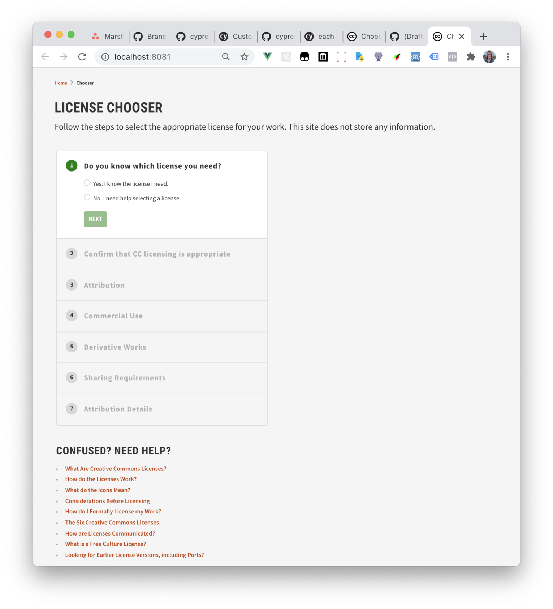

# chooser

The Creative Commons License Chooser is meant to help people learn about CC licenses, and select the license that best fits their needs. The new version in this repo places greater importance on usability, and an educational experience of the six CC licenses.

## About

Repository containing the source code for the new Creative Commons License Chooser. The new chooser is still in beta, and a beta deployment can be found [here](https://chooser-beta.creativecommons.org/).

This site is built using [Vue.js](https://vuejs.org/) (and vue-cli).

#### Roadmap

Tasks, issues, and discussion related to the release of the new chooser are tracked with the [`Launch Milestone`](https://github.com/creativecommons/chooser/milestone/1).

## Getting Started

Run the following commands in order to have the code up and running on your machine:

``` bash
# installs dependencies
$ npm install

# Builds and serves assets with hot-reload
$ npm run serve
```
You should now have the application running and accessible at http://localhost:8080 (note: will run on a different port if 8080 is occupied, most common alternative port is 8081).

## Contributing

For information on contributing, please see [Creative Commons' Contribution Guidelines](https://opensource.creativecommons.org/contributing-code/)

If you create a PR for your work, but you are not finished yet, please include `WIP:` in the beginning of your PR title. When your work on your PR is completed, and you are ready for a final review, please remove the `WIP:` prefix from the title to indicate that your work is done.

Here's a [handy link](https://github.com/creativecommons/chooser/issues?utf8=%E2%9C%93&q=is%3Aissue+is%3Aopen+sort%3Aupdated-desc+label%3A%22help+wanted%22+-label%3A%22in+progress%22) that will show you all open issues in this repo that have the `help wanted` tag, but do not have the `in progress` tag.
All issues in this list are up for grabs!
If it says "No results matched your search", then there are no issues currently up for grabs.

*If no progress has been made on an issue for seven days after assignment, the assignment will be removed to allow others to contribute.*

## Running Tests

You can run tests by executing:

```bash
$ npm run test
```

## CSS Build

The Chooser uses PostCSS plugin for PurgeCSS to make CSS bundle size smaller. It automatically removes unused CSS based on the classes found in the final built bundle. Some styles for dynamic components or dynamically-imported files can also be removed. If you find that the built site misses some styles, you can manually add the necessary classes or Regex expressions to the `safelist` array in the `postcss.config.js` file.

## Deployment

The chooser is deployed to GitHub Pages. The source files for the beta deployment are contained in the `./docs/` dir, and are live. Any changes to this directory's contents will be automatically deployed, so please take care when making modifications to this location.

To update the dist bundle, run ```$ npm run build```. This will also automatically copy the generated files from `./dist/` to `./docs/`.

## Output Modes

The site can be built in two different modes: `embedded` and `standalone`. `Embedded` mode removes the header and footer from the application, resulting in the following appearance:



To build into embedded mode, set the environment variable `VUE_APP_CC_OUTPUT=embedded` on your server before building. If `VUE_APP_CC_OUTPUT` is unset or set to a different value, the app will build in the default `standalone` mode, with its own header and footer.
